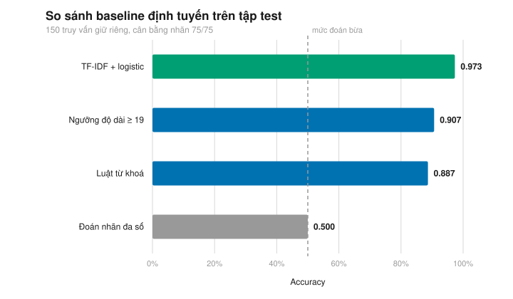
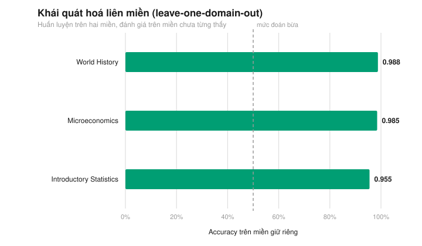

# DRA AI Tutor Research

[](https://github.com/nguyenvandang2201/DRA-AI-TUTOR-RESEARCH/actions/workflows/ci.yml)
[](LICENSE)
[](docs/dataset_card.md)
[](pyproject.toml)
[](docs/reproducibility.md)
[](pyproject.toml)
[](https://github.com/nguyenvandang2201/DRA-AI-TUTOR-RESEARCH/releases)
[](https://github.com/nguyenvandang2201/DRA-AI-TUTOR-RESEARCH/commits/main)

Kho lưu trữ này chứa tài liệu nghiên cứu, bộ dữ liệu và corpus phục vụ đề tài
Dynamic Routing Architecture (DRA) cho hệ thống AI gia sư. Mục tiêu của dự án
là hỗ trợ đánh giá định tuyến truy vấn theo mức độ phức tạp và miền kiến thức.

Câu hỏi trung tâm: một truy vấn của người học nên đi vào **nhánh tra cứu rẻ**
(`label = 0`, factual) hay **nhánh suy luận sâu tốn kém** (`label = 1`,
analytical), và quyết định đó có ra được bằng một bộ phân loại rẻ, tất định thay
vì gọi thêm một mô hình lớn hay không?

<p align="center">
  
</p>

## Cấu trúc thư mục

```text
dra-ai-tutor-research/
├── paper/      # Bản thảo bài báo PDF/DOCX
├── datasets/   # Bộ dữ liệu truy vấn đã gán nhãn (nguồn sự thật)
│   ├── splits/     # Split train/dev/test phân tầng (sinh tự động)
│   └── exports/    # Bản gộp CSV/JSONL (sinh tự động)
├── corpus/     # Nguồn văn bản tham chiếu theo từng miền
├── tools/      # Công cụ kiểm định, thống kê, split, baseline, hình vẽ
├── tests/      # Kiểm thử toàn vẹn dữ liệu và tính tái lập
├── results/    # Kết quả thực nghiệm dạng máy đọc được (sinh tự động)
├── figures/    # Hình SVG cho bài báo (sinh tự động)
└── docs/       # Tài liệu mô tả dữ liệu, thuật toán, thí nghiệm
```

## Bắt đầu nhanh

Yêu cầu duy nhất: **Python 3.9+**. Không có dependency nào cần cài.

```powershell
# Windows PowerShell
./tasks.ps1 check     # kiểm định dữ liệu + xác nhận file dẫn xuất + chạy test
./tasks.ps1 all       # sinh lại mọi file dẫn xuất rồi chạy test
```

```bash
# macOS / Linux
make check
make all
```

Thử định tuyến một truy vấn bất kỳ:

```bash
python tools/baseline_router.py --predict "How does the shutdown point compare to the zero-profit point?"
```

## Dữ liệu

| Miền | File | Bản ghi | Nhãn 0 / 1 |
| --- | --- | ---: | --- |
| World History | `datasets/dataset_world_history.json` | 336 | 168 / 168 |
| Microeconomics | `datasets/dataset_microeconomics.json` | 336 | 168 / 168 |
| Introductory Statistics | `datasets/dataset_introductory_statistics.json` | 336 | 168 / 168 |

Mỗi bản ghi có đúng ba trường:

```json
{
  "query": "How does the zero-profit point compare to the shutdown point?",
  "domain": "Microeconomics",
  "label": 1
}
```

Số liệu chi tiết (độ dài truy vấn, từ mở đầu, từ khoá phân biệt nhãn) nằm trong
[docs/dataset_stats.md](docs/dataset_stats.md), luôn được sinh lại từ dữ liệu.

## Công cụ

| Lệnh | Chức năng |
| --- | --- |
| `python tools/validate_datasets.py --strict` | Kiểm định schema, nhãn, miền, trùng lặp trong và giữa các file |
| `python tools/make_splits.py` | Sinh split train/dev/test phân tầng theo `(domain, label)`, seed cố định |
| `python tools/dataset_stats.py` | Sinh `docs/dataset_stats.md` |
| `python tools/baseline_router.py` | Chạy đánh giá baseline định tuyến |
| `python tools/baseline_router.py --report` | Sinh `docs/baseline_results.md` và `results/baseline_metrics.json` |
| `python tools/make_figures.py` | Sinh `figures/*.svg` |
| `python tools/export_dataset.py` | Xuất bản gộp CSV/JSONL |
| `python -m unittest discover -s tests -v` | Chạy toàn bộ test |

Mỗi script sinh file đều có cờ `--check` để CI xác nhận file dẫn xuất còn khớp
với dữ liệu nguồn.

## Baseline định tuyến

`tools/baseline_router.py` cài TF-IDF (1-2 gram) + hồi quy logistic **chỉ bằng
thư viện chuẩn Python**, nên số liệu lặp lại được trên máy trống, không cần
numpy hay scikit-learn. Kết quả hiện tại trên tập test giữ riêng:

| Mô hình | Accuracy | Macro-F1 |
| --- | ---: | ---: |
| TF-IDF + hồi quy logistic | 0,973 | 0,973 |
| Luật ngưỡng độ dài | 0,907 | 0,907 |
| Luật từ khoá | 0,887 | 0,886 |
| Đoán nhãn đa số | 0,500 | 0,333 |

Kiểm định chéo 5-fold đạt 0,983 ± 0,011; leave-one-domain-out đạt 0,955–0,988,
cho thấy router học đặc trưng cấu trúc câu hỏi chứ không chỉ từ vựng riêng của
từng miền. Bảng đầy đủ trong [docs/baseline_results.md](docs/baseline_results.md),
thiết kế thí nghiệm trong [docs/experiments.md](docs/experiments.md).

<p align="center">
  
</p>

Lưu ý diễn giải: độ chính xác cao một phần đến từ việc truy vấn do nhóm soạn có
khuôn mẫu bề mặt khá đều. Hãy xem đây là **mốc sàn**, không phải bài kiểm tra
khó — chi tiết trong phần giới hạn của [docs/dataset_card.md](docs/dataset_card.md).

## Tài liệu

| Tài liệu | Nội dung |
| --- | --- |
| [docs/dataset_card.md](docs/dataset_card.md) | Nguồn gốc, mục đích sử dụng, giới hạn đã biết |
| [docs/labeling_guidelines.md](docs/labeling_guidelines.md) | Định nghĩa nhãn và trường hợp ranh giới |
| [docs/architecture.md](docs/architecture.md) | Vị trí bộ dữ liệu trong DRA, luồng dữ liệu trong kho |
| [docs/algorithm.md](docs/algorithm.md) | Đặc tả toán học của baseline |
| [docs/experiments.md](docs/experiments.md) | Câu hỏi nghiên cứu, thiết kế thí nghiệm, cách đọc kết quả |
| [docs/reproducibility.md](docs/reproducibility.md) | Cách chạy lại và kiểm chứng tính tái lập |
| [docs/dataset_description.md](docs/dataset_description.md) | Schema và quy ước file |
| [docs/dataset_stats.md](docs/dataset_stats.md) | Thống kê mô tả (sinh tự động) |
| [docs/baseline_results.md](docs/baseline_results.md) | Kết quả baseline (sinh tự động) |
| [docs/faq.md](docs/faq.md) | Câu hỏi thường gặp |
| [docs/research_log.md](docs/research_log.md) | Nhật ký nghiên cứu |
| [ROADMAP.md](ROADMAP.md) | Kế hoạch phát triển |
| [CONTRIBUTING.md](CONTRIBUTING.md) | Quy trình đóng góp |
| [SUPPORT.md](SUPPORT.md) | Cách nhận hỗ trợ |

## Giấy phép

Mã nguồn và tài liệu trong kho phát hành theo giấy phép MIT (xem `LICENSE`).

Riêng `corpus/*.txt` trích từ sách giáo khoa **OpenStax**, giữ giấy phép
**CC BY 4.0** và yêu cầu ghi công OpenStax khi phát tán lại. Xem
[AUTHORS.md](AUTHORS.md) và mục nguồn gốc trong
[docs/dataset_card.md](docs/dataset_card.md).

## Trích dẫn

Xem [CITATION.cff](CITATION.cff), hoặc dùng nút "Cite this repository" trên GitHub.
